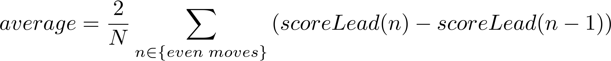

# Get More from KataGo output 
Allows to compute the euclidean distance of the different moves of a Go game and adds the average,min etc values of the Utility, Scoreleade and others.

## Table of contents
* [General info](#general-info)
* [Requirements](#requirements)
* [Technologies](#technologies)
* [Output](#output)
* [Setup](#setup)

## General info
This program allows to filter the outputed data from Katago and add a supecific information such as the euclidean distance.
Import this project into your favorite ide and change the urls in the main file to the respective Files.
Where the respective files are VirginFiles (SGF file of a GO game) and for the analyzedFiles the output file created by the KataGo response after the caluclation
and finally add the respective output folder for the KataGo responses.
## Requirements
The SGF file and the analysed katago file. The analysed katago file is the file containg the response of Katago according to the SGF file.
## Technologies
Its a program written in Java. However, it is in maven make sure to clean and build it to get the required dependencies such as GSON which is used to create the final output. 
## Output

| Usage | ScoreLead | Utility | IsRepresented | Euclidean distance |
| --- | --- | --- | --- | --- |
| Black&White | True | True | True | True |
| Min | True | True | True | True |
| Max | True | True | True | True |
| Mean | True | True | True | True |
| F_Mean | True | True | True | True |

Black&White means are the values seperated for each player.

Min shows the minimum of each value of each game according to Scorelead,utility and Euclidean distance.

Max the opposite of min.

The Mean value is the average value according to every scorelead or utility for every stone placed. (For black and white player seperatly)

F_Mean is a specific mean which is described as:

Where N the total amount of values are. For example, each move has one scoreLead if this list contains 10 moves than N will be 10.
n is the position of the element in the list for example the second one and n-1 is the previous one.
In case n is 0 starting index of the list the previous value will be 0.

## Setup
Download the project and import it in your favorite IDE.  Its a Maven Project make sure to clean up and build the project and install the different Dependencies such as GSON.
In addition, you will be required to change the URLs to your specifc file system URLs. For example linking the Virgin files folder to your local SGF files folder where you want to enhance the data gotten from KataGo.
